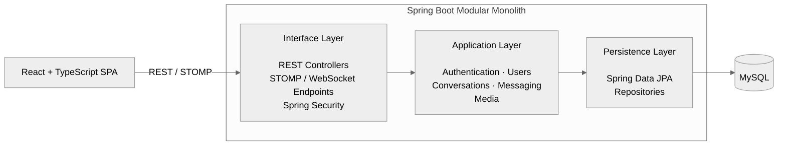

# Luma Realtime Chat Application

Luma is a full-stack realtime chat application built with a **modular monolith backend**.

The Spring Boot backend owns the business logic and runs as a single application, while the React client is a separate SPA communicating through REST APIs and STOMP/WebSocket.

This repository serves as the system-level entry point and includes the backend and frontend repositories as Git submodules.

## Repositories

| Module | Technology | Repository |
| --- | --- | --- |
| `backend` | Java 21, Spring Boot, Spring Security, JPA, MySQL, Redis, Flyway, STOMP, Cloudinary | [realtime-chat-server](https://github.com/tranverse/realtime-chat-server) |
| `frontend` | React 19, TypeScript, Vite, Tailwind CSS, TanStack Query, STOMP | [realtime-chat-client](https://github.com/tranverse/realtime-chat-client) |

## Features

- Email registration with OTP, login, password recovery, and refresh-token rotation
- Google OAuth2 with short-lived, single-use token exchange
- Private and group conversations with roles, ownership transfer, invitations, and join requests
- Realtime text and multi-image messaging with replies, editing, soft deletion, and typing indicators
- `Sent` and `Seen` read receipts with reconnect synchronization
- Authenticated image uploads through the backend to Cloudinary
- Multi-device session management and token revocation
- Responsive React interface with conversation filters, notifications, and isolated chat scrolling

## Architecture



### Supporting Infrastructure

| Component | Responsibility |
| --- | --- |
| **Redis** | Rate limiting and temporary state |
| **Cloudinary** | Image storage |
| **Google OAuth2** | External authentication |
| **Email Service** | OTP and account-related email |

## Screenshots

### Authentication

User authentication with email/password, Google OAuth2, password recovery, and secure JWT-based sessions.


### Realtime Messaging

Realtime private messaging with image sharing, delivery status, conversation search, and a responsive chat interface.


### Conversation Overview

Browse conversations, filter unread and group chats, track unread message counts, and quickly access recent conversations.


### Create Conversations

Start direct messages or create group conversations by searching and selecting participants.


### Group Messaging

Realtime group conversations with participant-specific messages, delivery status, and shared media support.


### Group Management

Manage group members, roles, ownership, and expiring invitation links with approval-based access.


### Profile & Session Management

Manage profile information, Google-linked accounts, and active sessions with device sign-out and global token revocation.


### Notifications

Unread message notifications with conversation previews and badge counts for quick access to new activity.


## Clone

Clone the repository together with its submodules:

```bash
git clone --recurse-submodules https://github.com/tranverse/realtime-chat-application.git
cd realtime-chat-application
```

For an existing clone:

```bash
git submodule update --init --recursive
```

## Run Locally

### Backend

Copy:

```text
backend/.env.example
```

to:

```text
backend/.env
```

Configure the required MySQL, Redis, mail, Google OAuth2, JWT, and Cloudinary credentials.

Then run:

```bash
cd backend
./mvnw spring-boot:run
```

On Windows:

```bash
cd backend
mvnw.cmd spring-boot:run
```

The backend runs at:

```text
http://localhost:8080
```

### Frontend

```bash
cd frontend
npm install
npm run dev
```

The frontend runs at:

```text
http://localhost:5173
```

During development, the frontend proxies API, OAuth2, and WebSocket traffic to the Spring Boot backend.

## Verification

### Backend

```bash
cd backend
./mvnw test
```

### Frontend

```bash
cd frontend
npm run lint
npm test
npm run build
```

Current verified baseline:

**18 backend tests · 23 frontend tests · All passing**

For implementation details, API documentation, architecture decisions, and testing notes, see the `README.md` and `docs/` directory inside each submodule.
