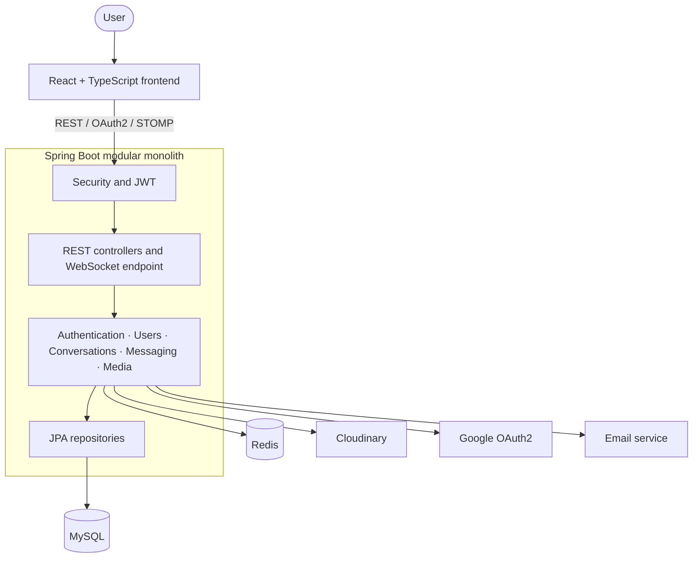

# Luma Realtime Chat Application

Luma is a full-stack realtime chat MVP built around a **modular-monolith backend**. The
Spring Boot backend owns the business logic and runs as one application; the React
client is a separate SPA that consumes its REST and STOMP/WebSocket interfaces.

This repository is the system-level entry point. It keeps the independently versioned
backend and frontend repositories as Git submodules.

## Repositories

| Module | Technology | Repository |
| --- | --- | --- |
| `backend` | Java 21, Spring Boot, Spring Security, JPA, MySQL, Redis, Flyway, STOMP, Cloudinary | [realtime-chat-server](https://github.com/tranverse/realtime-chat-server) |
| `frontend` | React 19, TypeScript, Vite, Tailwind CSS, TanStack Query, STOMP | [realtime-chat-client](https://github.com/tranverse/realtime-chat-client) |

## MVP features

- Email registration with OTP, login, password recovery and refresh-token rotation.
- Google OAuth2 with a short-lived, single-use token exchange code.
- Private and group conversations with member roles, ownership transfer and invitations.
- Realtime text and multi-image messages, replies, edit, soft delete and typing indicators.
- Accurate `Sent` and `Seen` read receipts with reconnect synchronization.
- Authenticated image uploads through the backend to Cloudinary.
- Responsive React interface with conversation filters, notifications and isolated chat scrolling.

## Architecture



The project does not use microservices. All backend modules run in one Spring Boot process
and are packaged as one application artifact.

## Clone

```bash
git clone --recurse-submodules https://github.com/tranverse/realtime-chat-application.git
cd realtime-chat-application
```

For an existing clone:

```bash
git submodule update --init --recursive
```

## Run locally

### 1. Infrastructure and backend

Copy `backend/.env.example` to `backend/.env`, configure MySQL, Redis, mail,
Google OAuth, JWT and Cloudinary credentials, then run:

```bash
cd backend
./mvnw spring-boot:run
```

On Windows, use `mvnw.cmd spring-boot:run`. The API starts at `http://localhost:8080`.

### 2. Frontend

```bash
cd frontend
npm install
npm run dev
```

The SPA starts at `http://localhost:5173` and proxies API, OAuth and WebSocket traffic to
the monolith during development.

## Verification

```bash
# Backend
cd backend
./mvnw test

# Frontend
cd frontend
npm run lint
npm test
npm run build
```

Current verified baseline: 18 backend tests and 23 frontend tests, all passing.

See each submodule's `README.md` and `docs/` directory for API, architecture, testing,
and implementation notes.
