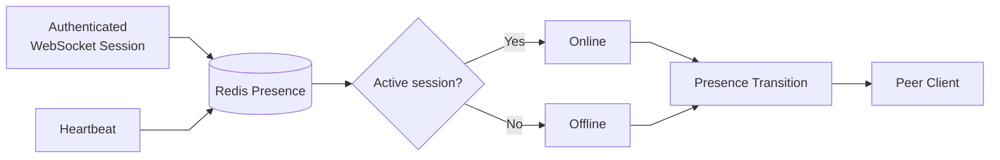
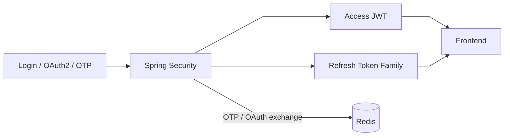

# Realtime Chat Application

A full-stack realtime messaging application built with **React, TypeScript, Java, and Spring Boot**.

It supports private and group conversations, realtime messaging, image sharing, read receipts, typing indicators, secure authentication, and multi-device Online/Offline presence.

The backend follows a **modular monolith** architecture and communicates with the frontend through **REST APIs** and **STOMP/WebSocket**.

---

## Architecture


### Backend modules

| Module | Responsibility |
|---|---|
| **Auth** | OTP registration, login, OAuth2, JWT rotation, password recovery, session revocation |
| **Users** | Profiles, account information, user search |
| **Conversations** | Private/group chats, members, roles, invites, join requests |
| **Messaging** | Send, reply, edit, delete, history, read receipts, typing |
| **Media** | Authenticated image upload and storage |
| **Presence** | Online/Offline state, heartbeat, multi-session tracking |

The modules run inside a **single Spring Boot application**. They are separated by responsibility, not deployed as independent microservices.

---

## Realtime Messaging


```mermaid
%%{init: {"flowchart": {"curve": "linear"}}}%%
flowchart LR

    CLIENT["Client"]

    AUTH["Authenticate"]

    LOCK["Lock Conversation"]

    MEMBER["Validate Membership"]

    SEQ["Allocate Message Sequence"]

    DB[("MySQL")]

    EVENT["After-Commit Event"]

    STOMP["STOMP Topic"]

    PEERS["Subscribed Clients"]

    CLIENT --> AUTH
    AUTH --> LOCK
    LOCK --> MEMBER
    MEMBER --> SEQ
    SEQ --> DB
    DB --> EVENT
    EVENT --> STOMP
    STOMP --> PEERS
```

Messages inside a conversation use an increasing sequence:

```text
1 → 2 → 3 → 4 → ...
```

The database protects ordering with:

```sql
UNIQUE (conversation_id, sequence)
```

A **pessimistic lock** on the conversation coordinates concurrent sequence allocation.

The lock is acquired before database-backed membership and sequence reads to avoid stale reads under MySQL `REPEATABLE READ`.

Realtime events are published **after the database transaction commits**, preventing clients from receiving data that was later rolled back.

---

## Presence

Online/Offline status is not stored as an `isOnline` column in MySQL.

Presence is temporary state managed in **Redis**.


```mermaid
%%{init: {"flowchart": {"curve": "linear"}}}%%
flowchart LR

    WS["Authenticated
    WebSocket Session"]

    HEART["Heartbeat"]

    REDIS[("Redis Presence")]

    STATE{"Active session?"}

    ONLINE["Online"]

    OFFLINE["Offline"]

    EVENT["Presence Transition"]

    CLIENT["Peer Client"]

    WS --> REDIS
    HEART --> REDIS

    REDIS --> STATE

    STATE -->|"Yes"| ONLINE
    STATE -->|"No"| OFFLINE

    ONLINE --> EVENT
    OFFLINE --> EVENT

    EVENT --> CLIENT
```

Each browser tab/device has its own presence session.

```text
Laptop + Phone connected
        ↓
      Online

Laptop disconnects
        ↓
Phone still connected
        ↓
      Online

Final session expires
        ↓
      Offline
```

Default timing:

| Setting | Value |
|---|---:|
| Heartbeat | 25 s |
| Session expiry | 75 s |
| Expiry sweep | 5 s |

Only effective transitions are broadcast:

```text
OFFLINE → ONLINE
ONLINE  → OFFLINE
```

---

### Storage responsibilities

**MySQL**

- users
- conversations
- memberships
- messages
- attachment metadata
- refresh-token families
- read positions
- invite links and join requests

**Redis**

- OTP rate limits
- single-use OAuth2 exchange codes
- realtime presence sessions

**Cloudinary**

- uploaded image content

Redis is not used as the message database or a durable message queue.

---

## Message History

Message history uses **sequence-based keyset pagination**:

```http
GET /api/v1/conversations/{conversationId}/messages
    ?beforeSequence=500
    &size=50
```

Conceptually:

```sql
WHERE conversation_id = ?
  AND sequence < ?
ORDER BY sequence DESC
LIMIT ?
```

This avoids the increasing scan cost of deep OFFSET pagination.

Local MySQL benchmark at 500K messages:

| Strategy | Deep-page p95 |
|---|---:|
| Keyset | ~17 ms |
| OFFSET | ~4.38 s |

These are **local benchmark results**, not production latency guarantees.

---

## Authentication


```mermaid
%%{init: {"flowchart": {"curve": "linear"}}}%%
flowchart LR

    LOGIN["Login / OAuth2 / OTP"]

    AUTH["Spring Security"]

    ACCESS["Access JWT"]

    REFRESH["Refresh Token Family"]

    REDIS[("Redis")]

    CLIENT["Frontend"]

    LOGIN --> AUTH

    AUTH --> ACCESS
    AUTH --> REFRESH

    AUTH -->|"OTP / OAuth exchange"| REDIS

    ACCESS --> CLIENT
    REFRESH --> CLIENT
```

Authentication includes:

- email/OTP registration
- password login and recovery
- Google OAuth2
- access and refresh JWTs
- refresh-token rotation
- reuse detection
- session revocation
- logout / logout all

---

## Tech Stack

**Backend**

`Java 21` · `Spring Boot` · `Spring Security` · `JPA/Hibernate` · `MySQL` · `Redis` · `Flyway` · `WebSocket/STOMP` · `Docker`

**Frontend**

`React` · `TypeScript` · `Vite` · `Tailwind CSS` · `TanStack Query` · `STOMP.js`

**Testing**

`JUnit` · `Testcontainers` · `Vitest` · `Playwright` · `k6`

---

## Repository Structure

```text
realtime-chat-application/
├── backend/       # Spring Boot backend submodule
├── frontend/      # React frontend submodule
├── e2e/           # Playwright system tests
├── performance/   # k6 regression tests
├── scripts/
└── compose.e2e.yml
```

Clone with submodules:

```bash
git clone --recurse-submodules https://github.com/tranverse/realtime-chat-application.git
cd realtime-chat-application
```

---

## Run Locally

### Backend

```powershell
cd backend
.\mvnw.cmd spring-boot:run
```

### Frontend

```bash
cd frontend
npm ci
npm run dev
```

Environment configuration is provided through the backend and frontend `.env.example` files.
